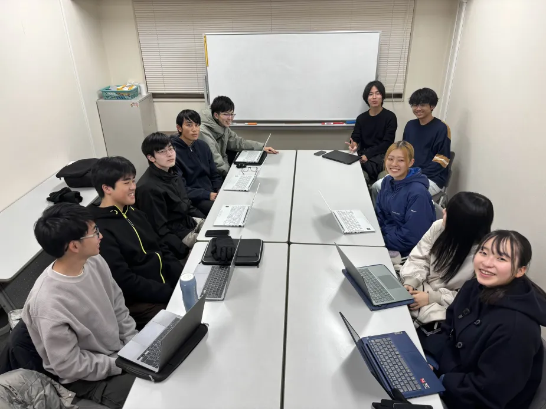

# iGEM Kyotoとは
iGEM Kyotoは**合成生物学の世界大会iGEM (International Genetically Engineered Machine) への参加を行う、京都大学学部生によるサークル**です。**2008年に設立**されて以降今に至るまで精力的に活動を続けており、これまでに**15回のiGEM大会出場**、**累計9回の金賞獲得**を達成しています。2025年10月にパリで行われた大会では、５大会連続となる金賞獲得という快挙を成し遂げました。**当団体は活動の主体となる学部1、2年生や実験監督を行う教員、その他活動支援を行うアドバイザーなどにより構成**されており、大会参加のための**プロジェクトテーマの決定から実験、数値解析、テーマに関連する当事者有識者の方々への話のお伺いに及ぶまで、様々な活動**を行っています。メンバー間での親睦を深める、iGEM大会へ参加する他大学の団体のメンバーとの交流するなど、団体メンバーは活動の中で様々な場で友好を深めています。

# 合成生物学とは
フランスの生物学者Stéphane Leducによる1910年の著作にて用いられて以降、初のDNA複製を皮切りに合成生物学という語は生物学における存在感を徐々に増していきました。1970年代以降、制限酵素の発見やPCR技術、合成生物学的回路等の発明が行われ、合成生物学はその基礎を築き上げ、急速に発展していきます。**合成生物学は新規の生物システム、生物装置等の開発、既存の自然システムの改変を行う学問**であり、その**応用範囲の広さが故に分子生物学、遺伝子生物学のみならず生物化学や生物物理、発生生物学に至るまで多様な研究分野**を有しています。これまでに**医薬品の微生物による安価な製造やバイオ燃料の効率的な生産等様々に実用化**されており、現在、**「合成生物学・バイオ」分野は高市政権においても国の経済成長を牽引する戦略的投資分野に指定されるなど、社会課題の解決に大きな期待が寄せられている学問分野**でもあります。

# iGEMとは
iGEM(International Genetically Engineered Machine)とは、**2004年より通年開催されている国際的な合成生物学大会**です。iGEMは、**大会での教育やコンペティションを通した合成生物学における次世代の指導者や技術者の育成や、安全かつ透明性の高い合成生物学の社会実装を目的**としており、より健全な弾性のある持続可能な世界の実現を促進するようなコミュニティ形成の場としても機能しています。大会では**高校生、大学学部生、大学院生らがそれぞれ社会問題解決のための生物システムを開発し、研究成果は実験結果やシミュレーション結果、実装可能性や倫理面において評価されます**。

# 当団体の目的
当団体iGEM Kyotoは **「学生が責任と自主性に基づき自由に研究活動を行うことのできる団体を実現する」ことを目的** に活動しています。このような目的は学生メンバーの合成生物学への知見の深化、ひいてはより広範な学問的知見の獲得へ貢献しており、**当サークルにて知見を積んだメンバーの多くは現在、大学内の研究室や製薬会社など様々な場にて活躍**しています。
