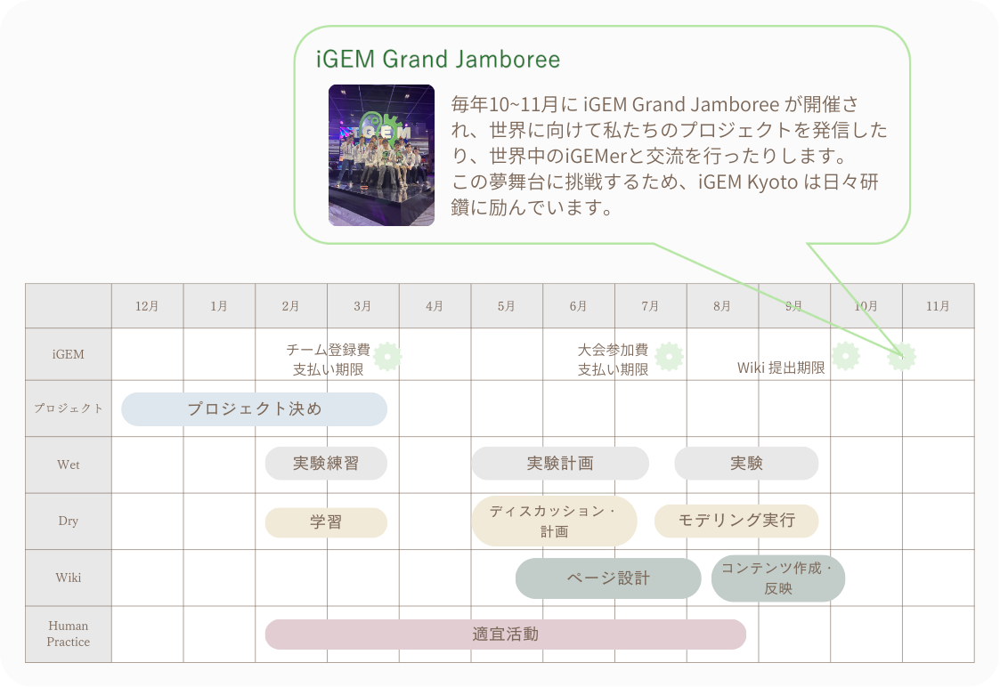
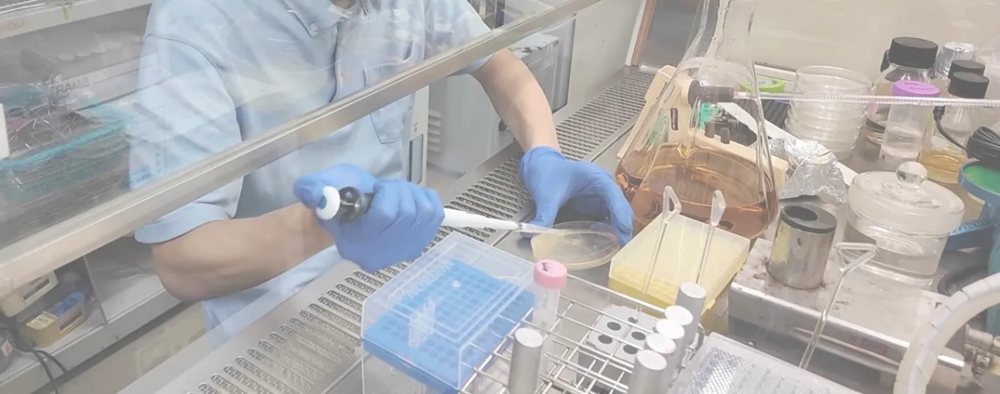

# PROJECT

当団体では、iGEM大会にて世界に挑戦するため、**Wet**、**Dry**、**Human Practice**、**Wiki制作**、**広報・資金調達**といった幅広い活動を行っています。  
どの分野においても学生メンバーが主体的に活動し、プロジェクトを最高のものにするために頑張っています。  
それぞれの分野の概要とメンバーの活動に焦点を当てて説明します。

# Schedule

# Wet

Wetとは、バイオの研究において、実際に生物を用いて実験する部分のことを指します。  
名前から連想されるように、水や試薬を実際に使って研究することから、生命科学や生物の研究では、実験分野をWetと呼びます。

Wetでは、DNAやタンパク質、微生物を実際に用いて実験し、理論が正しいのか、考案した機構がうまくワークするのかを確かめます。

当団体のWetでは、実験計画を立てるところから研究室での実験、データの収集まで、学生メンバーが主体となって研究を進めています。

## 実験計画の立案

取り組むプロジェクトが決まってから、文献調査や専門家との対談を重ねて、実験計画を立てます。

単に実験を行うのではなく、「何を証明したいのか」「それをどう示すのか」を最初に明確にします。  
例えば、「物質Aを合成する」という実験では、物質Aが実際に生成したことを示す必要があります。そのために、物質Aと反応すると発光する試薬を用いるなど、結果を可視化できる方法を選ぶことで、生成を確認できます。

実験で行うことが決定したら、必要な生物やタンパク質を考え、DNAの配列を設計します。

homepage\_project2

設計したDNA配列は、プロモーターやタグ、目的遺伝子の配置などを含めてプラスミドとして構築します。  
この段階で、発現量の調整や精製のしやすさ、後の解析方法までを考慮し、実験全体が無理なくつながるように設計します。

## 実験の遂行

homepage\_project3

立案した実験計画に基づき、実際に研究室で実験を遂行します。  
ここがiGEM Kyotoの活動の山場です。  
主に夏休みを利用して、メンバーが毎日のように実験を行っています。  
先生やアドバイザーから助言をもらうこともありますが、基本的には1-2回生の学生が手を動かし実験を進めます。

homepage\_project4  
homepage\_project5

主な実験内容には、

* 大腸菌を用いた組換えタンパク質の発現・精製  
* タンパク質の機能評価  
* Dryとの連携による変異体設計・機能改変実験

などの基盤となるものや、プロジェクトに合わせて応用的なものがあります。

時にはうまく結果が出ないときもありますが、実験結果の見直しやDryとの連携を行い、理論が正しいことを証明するために可能なことを尽くします。

学部1-2回生にとって、実験計画を立案するところから実験を遂行するまでは、かなりの壁となります。しかし、チームの仲間とともに挑戦し、良い結果が出たときには達成感で満ち溢れます。

# Dry

homepage\_project6

Dryとは、バイオ研究においてコンピュータ上で理論設計や解析を行う分野を指します。  
実験台の上で試薬を扱うWetに対して、Dryでは数式・アルゴリズム・シミュレーションを用いて、生命現象や分子のふるまいを理論的に解析・予測します。  
まさにWetとDryは、生命科学の研究において互いに補完し合う両輪です。

具体的には、個体間感染シミュレーション、バイオセンサーの発現量予測、タンパク質構造の最適化など、プロジェクトに応じて多様なアプローチを行っています。

当団体のDryでは、学生は主に自主的な学習によって、計画立案からモデルの構築、シミュレーションの解析までに必要なスキルを獲得し、試行錯誤を繰り返しながらプロジェクトを進めています。

## モデルの構築

homepage\_project7

プロジェクトのテーマが決定すると、Dryではまずシミュレーションを行う対象を考えます。ここでの目的は、実験では直接観察しにくい挙動を可視化し、仮説検証を可能にすることです。

例えば、遺伝子発現量がどのように変化するか、タンパク質の構造変化が機能にどう影響するか、分子がどのように相互作用するのか、というような問題を提起します。

次に、取り組む問題を決めたら、コンピューターで再現するためのモデルを構築します。

現実の挙動に整合するようなモデルを構築することを目標とし、論文等を参照にしながら、最適なパラメーターや閾値などを決定します。  
このモデル化の段階では、Wetからの実験結果をもとに設計したり、構築したモデルにおける結果を振り返って再構成したりして、試行錯誤を繰り返すことによって最善のモデルを構築します。

## シミュレーション

homepage\_project8  
homepage\_project9

構築したモデルをもとに、コンピュータ上でシミュレーションやデータ解析を行います。

シミュレーションの動作がうまくいかなかった場合は、モデルを構築し直し、試行錯誤を繰り返すことによって、モデルを最善のものにします。

シミュレーションの結果は、Dryとしての結果だけでなく、Wetでの実験にもフィードバックされます。  
Dryで設計・予測した内容をもとにWetが実験を行い、その結果を再びDryが解析・モデルの改良につなげる、というサイクルを繰り返します。  
この往復によって、より洗練された実験の設計や効率的な仮説検証が可能になります。

プログラミングや数理モデルに初めて触れる1-2回生にとって、Dryは決して簡単な分野ではありません。  
しかし、チームで議論を重ね、理論と実験が一致した瞬間には、大きな達成感を得ることができます。

# Human Practice

homepage\_project10

Human Practiceとは、研究や技術を社会との関係の中で捉え、より良い形で実装するための活動を指します。  
プロジェクトの取り組む社会問題における関係者や一般の人々、プロジェクトの分野における有識者へ話を伺い、社会問題における詳細な課題点やプロジェクト分野の専門的知識の理解を深めることを目標とします。

iGEMでは、合成生物学分野での研究だけでなく、地域社会と世界への貢献が重要視されています。そのため、倫理・安全性・社会的ニーズ・制度など、さまざまな社会的要素を考慮する必要があります。  
「研究が世界にどう影響し、世界が研究にどう影響するか」といった、社会との双方向の対話を行うことによって、プロジェクトの向上・効果的な発信を目指します。

iGEM KyotoのHuman Practiceでは、話を伺いたい利害関係者や専門家の候補を挙げることからアポイントメントの相談、先方への取材、最終的な結果の報告まで、すべて学生が主体となって行っています。

## インタビューの計画

当団体では、取り組むテーマを決める段階や、テーマが決まってからプロジェクトを発展させる段階など、様々な場面でHuman Practiceを行います。

まずはチームで、何を取材したいのかを明確にし、取材先の候補をリストアップします。  
社会的なニーズや制度などを伺いたいときは企業や行政、私たちのプロジェクトに対する専門的なアドバイスを伺いたいときは大学教員や企業研究所にインタビューに行くなど、目的に応じて取材先は多岐にわたります。

取材したい相手方を決めたら、お話を伺えるように連絡を取り、そして事前準備を行います。  
iGEM Kyotoの活動や取材の意向を説明し、アポイントメントの調整を行います。  
そして、取材の前には、限られた時間の中で有意義な対話ができるよう、質問リストを練り上げ、入念に準備します。

## インタビューの実施とフィードバック

入念な準備を経て、実際に利害関係者や企業、専門家の話を伺います。

実際のインタビューでは、プロジェクトに対する生の声や専門的なアドバイスを伺います。  
プロジェクトに関する率直な意見や専門的な知見から、想定していなかった壁や、現場ならではの切実なニーズに気づかされることが多々あります。

そして取材後には、得られた意見や知識を活かしてプロジェクトを修正します。  
専門家から得られた知見をもとにWetやDryを設計し直したり、人々の意見をもとにしてプロジェクトをさらに発展させたり、時にはプロジェクトの思い切った変更を行ったりし、プロジェクトをより良いものへ改善します。

このHuman Practiceの過程を通じて、研究者の視点だけでは見えにくいニーズや懸念点を明らかにしたり、専門的なアドバイスをいただいたりすることで、プロジェクトの改善と発展を繰り返します。

バックグラウンドの異なる様々な方と対話することは、時に自分たちの前提を覆される苦労もありますが、その分、プロジェクトが社会に真に貢献できる形へと研ぎ澄まされていく喜びがあります。

# Wiki制作

homepage\_project11

Wiki制作では、iGEMの大会において、プロジェクトの成果をまとめたウェブページ「Wiki」を作成し、、インターネットを通じて世界に発信します。

iGEMでは、社会問題の背景やプロジェクトの概要の説明、WetやDryの結果だけでなく、Human Practice、トライ&エラーの過程まで含めてWiki上で公開することが求められています。  
作成したWikiはiGEM大会の審査項目として用いられ、Wikiに書かれている内容はもちろんのこと、Wikiの視認性やデザインも審査の対象となります。

当団体のWiki制作では、メンバーのWiki担当者がページの設計・コーディングを行い、コンテンツをメンバー全員が分担して執筆します。メンバー全員の力を合わせて最高のWikiを作成することを目指します。

## コーディングとデザイン

homepage\_project12

Wiki制作にあたり、まずはページ構成とデザインを決めます。  
伝えたいことが正確に伝わるように、サイトを訪れた方が見やすいように、ページのどこに何を配置するか、どのようなデザインにするのかを考えます。  
過去のiGEM大会でWikiの評価が高かったチームや、デザインについての本などを参考にしながら構想します。

ページの構成が決まった後は、Webコーディングの言語を用いてWikiのひな形を実装します。  
HTML・CSS・JavaScriptなどの言語を用いて、サイトの骨組み、デザイン、アニメーションをWikiに反映させます。  
コーディング経験が浅いメンバーも、自主的に勉強したり、互いに教え合いながら開発を進めています。

## コンテンツの執筆

ページの構造に合わせて、プロジェクトの概要や実験結果等のコンテンツを執筆します。  
書く内容は、Home、プロジェクトの概要、試行錯誤の過程、Wetの結果、Dryの結果、Human Practice、チームメンバーの紹介など、多岐にわたります。  
また、文章だけでなく、イラストや写真を含めることによって、サイトを訪れた人が分かりやすいように工夫します。  
iGEM Kyotoでは、活動を行った人が中心となってメンバー全員で文章を執筆し、最終的に英語に翻訳します。

締め切りが近づくにつれて、夜遅くまで作業が続いたり、思うように進まず苦労することもあります。しかし、メンバー同士で支え合って完成させたWikiが公開された瞬間、チームとして大きな達成感を共有することができます。

homepage\_project13

# 広報・資金調達

当団体では、プロジェクトに関わることだけでなく、広報や資金調達など、研究を支えるための活動も行っています。

## 広報

homepage\_project14

広報活動では、iGEMやiGEM Kyotoの取り組みについて専門外の方にも分かりやすく伝え、合成生物学やiGEMについて興味を持ってもらうとともに、社会の方々と関わりを持つことを目的とします。

具体的には、

* SNSやWebを通じた情報発信  
* イベントを通じた発信

などを行っています。

SNSやニュースレターを通じて、定期的に当団体の活動をご報告しています。  
また、京都大学アカデミックデイや11月祭などのイベントに参加し、iGEMやチームの活動について紹介しています。

広報活動を通じて、日本ではまだ十分に普及していないiGEMや合成生物学について理解を深めていただくことを目指しています。  
また、一般の方々との対話や交流を通じて得られる視点は、プロジェクトの新たなアイデアにつながることもあり、研究内容を見直すきっかけにもなります。

## 資金調達

iGEMへの参加や研究活動には、試薬費や機材費、参加費など多くの費用が必要です。  
そのため当団体では、企業・団体・個人の方々からの支援を受けながら活動しています。

生物学やプロジェクトに関係する企業や地元京都の団体などにコンタクトを取り、当団体の活動についてご紹介し、スポンサーとなっていただいています。  
また、OB・OGや広報活動で知り合った方々に寄付をお願いすることもあります。

協賛・寄付していただいた資金は、iGEM大会への登録費および参加費、実験に必要な試薬や機器の調達に使用します。

iGEM Kyotoの活動はこのように皆様のご支援から成り立っています。  
そのことを忘れず、皆様の期待に応えられるように当団体も努力してまいります。
