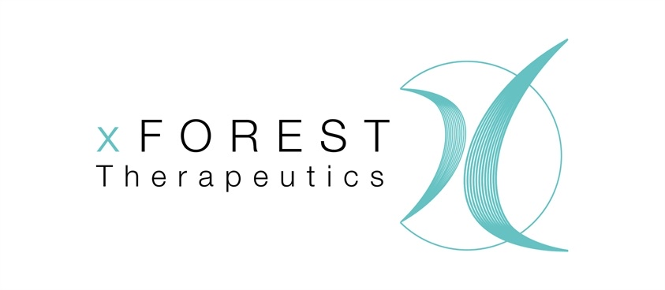

# サポーターの皆様
2025年度、ご支援いただいた方々を紹介します。

<<<<<<< HEAD

  

    
  

  

    
    
xFOREST Therapeutics 田尻健 様

  

=======

xFOREST Therapeutics 田尻健 様  
>>>>>>> 862b6a2cda4980200cfe580c32ca920889279c94

その他にも多くの方々からご支援、ご助言を頂きました。皆様のおかげで活動ができたこと、大変嬉しく思います。ありがとうございました。  

2023年度に、学術系クラウドファンディングサイト「academist（アカデミスト）」でご支援いただいた方々をご紹介します。 皆様、本当にありがとうございました。 詳細はこちらからご確認いただけます。  

xFOREST Therapeutics 様  
林オートサービス 様  
Shunichi KASHIDA 様  
Ryo NIWA 様  
S. J. Shimada 様  
海野真司 様  
Yuki Kobayashi 様  
SMNomura 様  
Ken Tajiri 様  
小松リチャード馨 様  
wataru 様  
M Yagyu 様  
「京大当局は吉田寮自治存続を保証すべき」会有志 様  
M. Tokoro 様  
M.O. 様  
徳法寺 様  
ICKW 様  
増本 敬二（東17期） 様  
唐津東11期卒 戸田芳郎 様  
Masahi Tsuda 様  
イカのダンスはすんだのかい 様  
田中千絵 様  
タニグチイチロウ 様  
島添 將誠 様
