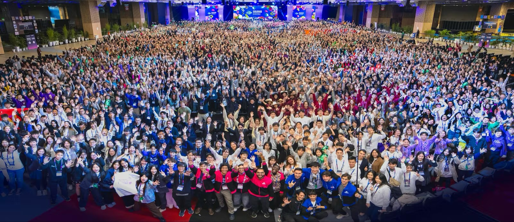

# 支援のお願い
私たちを応援してくださる企業・個人の方を募集しております  

振込口座はこちらです。  

 金融機関名　ゆうちょ銀行  
 店名　四四八（ヨンヨンハチ）  
 店番　448  
 預金種目　普通預金  
 口座番号　4484604  
 口座名義　iGEM Kyoto(アイジェムキョウト)  
  ※振込手数料は自己負担になります

## 次世代を担う合成生物学の旗手として
iGEM Kyotoは、次世代の基幹技術である合成生物学に情熱を注ぎ、その可能性を追求する京都大学の学生チームです。
今、合成生物学は世界中で最注力分野として爆発的な進化を遂げています。医療、環境、エネルギー、農業……あらゆる産業を改革するこの技術は、地球規模の課題解決の切り札として、国境を越えた熾烈な研究開発競争が繰り広げられています。
しかし、欧米や中国が国を挙げてこの分野に巨額の投資を行うなか、日本が国際的なリードを保ち続けるためには、次世代を担う若手研究者の育成が急務です。
私たちは、京都大学から世界へ、日本の合成生物学の力を示すことを使命としています。

## 世界一を目指す挑戦
私たちは毎年、世界最大の合成生物学大会iGEMでの上位入賞を目標に掲げています。単なる研究にとどまらず、自らの好奇心に従い、科学がどのように社会課題を解決できるか。その新たな道を模索し続けてきました。
これまでの歩みと実績
iGEM Kyotoは、これまで数多くの国際的な評価をいただいてきました。
* 2019年： 洗濯排水からのマイクロプラスチック回収手法（金賞・2部門で部門賞ノミネート）
* 2021年： 切り花のウイルス検出・RNAi害虫駆除（金賞・Best Software Tools部門ノミネート）
* 2023年： ししおどしの原理で忌避剤を自給自足し、農作物を守る野生動物制御システム(金賞・Agriculture / Hardware / wikiの3部門で部門賞ノミネート)
* 2024年： 過剰施肥による環境汚染を防ぐ、現場即時型の高精度窒素バイオセンサー(金賞・ Agriculture Project 部門世界1位)
* 2025年： パンデミックを細胞レベルで阻止する、鳥インフルエンザ感染拡大防止回路(金賞)
  
学部生のうちから科学の共通言語で議論し、世界の志を同じくする学生と交流する経験は、何物にも代えがたい次世代リーダーの育成の場となっています。  

## 私たちが直面している課題  

しかし、世界一を目指す挑戦を続けるためには、多額の活動費用という大きな壁があります。
現在、チーム登録費（約87万円）や大会出場費（約47万円）に加え、日々の研究に必要な試薬代、社会実装に向けたアウトリーチ活動費など、1シーズンで数百万円規模の資金が必要です。近年、大会参加費の大幅な高騰が続いており、学生の自己負担だけでは活動の継続が極めて困難な状況にあります。  

実際に、2015年度や2022年度には、十分な研究成果がありながらも資金不足により出場を断念せざるを得ないという悔しい経験もいたしました。  

## 志を共にしてくださるサポーターの皆様へ  

私たちは、これまでも多くの個人・団体の皆様に支えられて歩んできました。京都大学SPECの補助金をはじめ、TOYOBO様、長瀬産業様といった企業様からの試薬や活動費のご支援が、私たちの挑戦を支える大きな力となっています。この場を借りて深く御礼申し上げます。  
iGEM Kyotoは、私たちの活動に賛同し、共に未来を創ってくださる新たなパートナーを募集しています。  
皆様からのご支援は、未来の科学者たちの挑戦を支える貴重な糧となります。金銭的なご寄付だけでなく、共同研究や技術指導、試薬のご提供など、さまざまな形でのご支援をお待ちしております。  
私たちの情熱が、社会を変える大きな力へとつながるよう、ぜひお力添えをお願い申し上げます。  

## 寄付いただいた資金の使途について
* iGEM Jamboree(大会) への登録費および参加費
* 生物学実験に必要な試薬や機器の調達
* 大会へ提出する成果物にかかる費用
* 取材や教育などの社会活動

